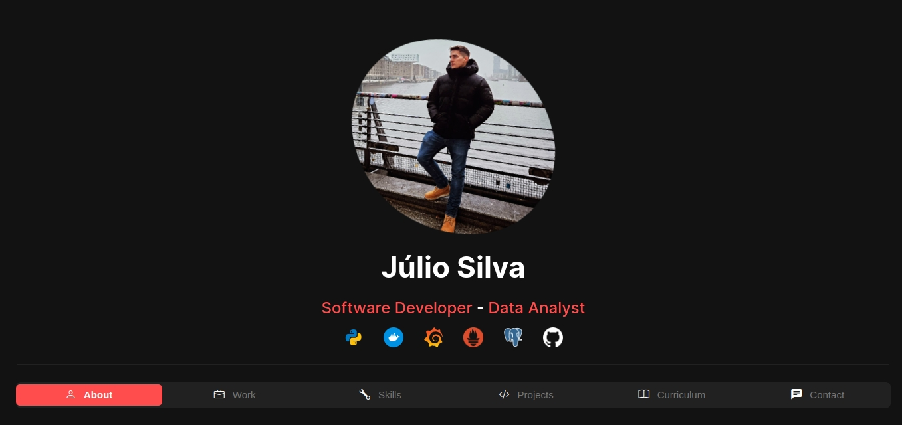

# Streamlit-based Portfolio

This repository contains the code for my portfolio, built using Streamlit. Feel free to modify the code to suit your specific needs.

## Getting Started

To set up the environment, follow these steps:

1. Run `direnv allow` to enable direnv for the project.

2. Run `make run` to launch the porfolio
